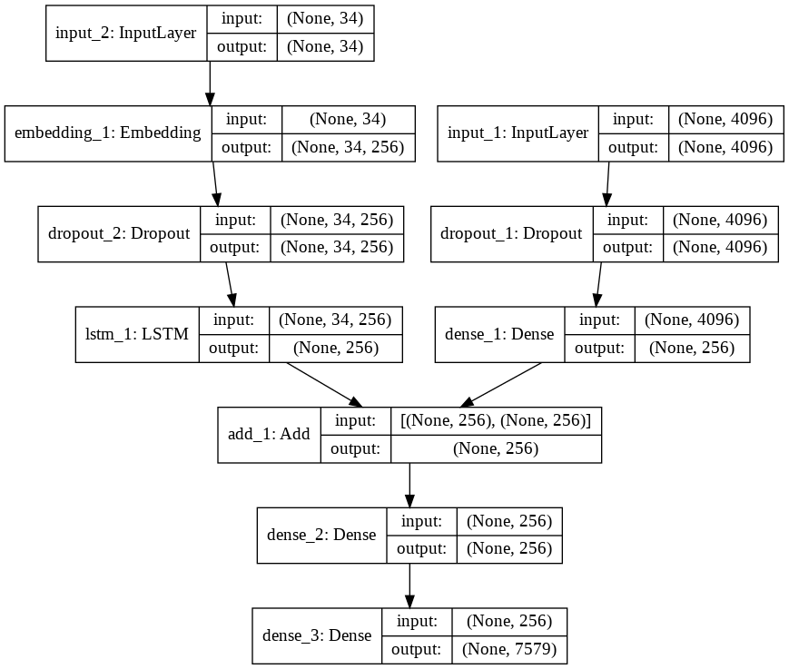
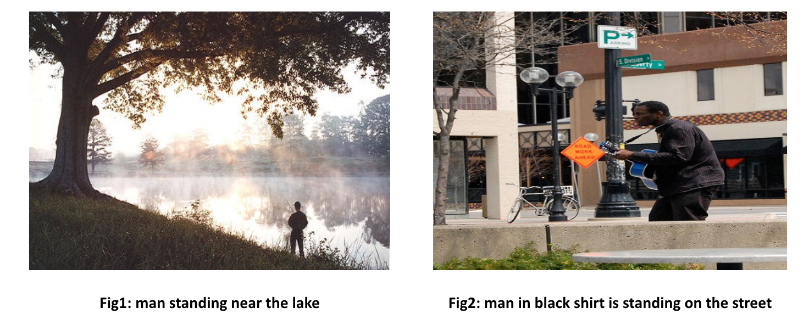
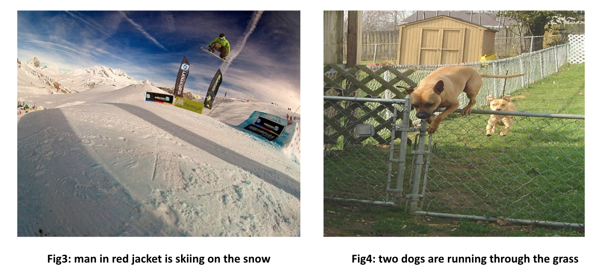

# Image-Caption-Generator
Generating Image Captions using Long-Short Term Memory and Recurrent Neural Network.

## Introduction 
- Image Caption Generation is outputting a correct and concise description of a given image.
- Automated captioning of images demands an understanding of the fields of Computer Vision as well as Natural Language Processing.
- Automated captioning is useful in situations where an image takes time to load or is unavailable. 
- These captions can also be used to classify the images.

## Baseline
- We are using the paper “Learning CNN-LSTM Architectures for
Image Caption Generation” by Moses Soh as our baseline.
- This paper has proposed using a deep CNN to generate a vectorized
representation of an image that is given as input to the LSTM to
generate the caption. This is the top-down approach.
- The main drawback of captions generated by models based on the
top-down approach is their inability to capture minute details.
- We have implemented a model that uses a RNN in order to overcome this drawback.

## Dataset
- Flickr8k dataset contains 8092 photographs along with text descriptions by their photographs
- The dataset is about 8 GB in size
- Extract features from images using VGG16 
- Load descriptions for each image
- Clean the descriptions by removing 
punctuations, converting all words to 
lowercase and removing numbers 

## Model Architecture

- Photo Feature Extractor 
  - input photo features as vector of 4096 elements
  - 50% dropout
- Sequence Processor
  - input sequences of 34 words
  - Embedding layer that used to ignore padding
  - 50% dropout 
  - LSTM with 256 memory units
- Decoder
  - Add both outputs from the two units
  - Dense layer to make prediction of next word

## Final Model Hyperparameters

|      Hyperparameter      |           Value          |
|:------------------------:|:------------------------:|
| Feature Extraction Model |           VGG16          |
|          Epochs          |            10            |
|          Dropout         |            0.5           |
|        LSTM Layers       |            256           |
|         Optimizer        |      adam (1.00E-03)     |
|       Loss function      | categorical_crossentropy |

## Results and Metrics

Dropout = 0.5
|       Model       | BLEU1 Score | BLEU2 Score | BLEU3 Score | BLEU4 Score |
|:-----------------:|:-----------:|:-----------:|:-----------:|:-----------:|
|       VGG16       |    0.565    |    0.3342   |    0.2377   |    0.164    |
|       VGG19       |    0.5169   |    0.2554   |    0.1661   |    0.0932   |
|    InceptionV3    |    0.5283   |    0.284    |    0.199    |    0.1003   |
|      ResNet50     |    0.4533   |    0.1971   |    0.1322   |    0.0634   |
| InceptionResNetV2 |    0.5059   |    0.2398   |    0.1634   |    0.0861   |  
  
Model = VGG16
| Dropout | BLEU1 Score | BLEU2 Score | BLEU3 Score | BLEU4 Score |
|:-------:|:-----------:|:-----------:|:-----------:|:-----------:|
|   0.25  |    0.4232   |    0.1988   |    0.0813   |    0.0312   |
|   0.5   |    0.565    |    0.3342   |    0.2377   |    0.164    |
|   0.75  |    0.5422   |    0.2994   |    0.1855   |    0.1449   |
|  0.875  |    0.5239   |    0.281    |    0.1824   |    0.1253   |
|    1    |    0.4911   |    0.2672   |    0.1693   |    0.1058   |

## Generated Captions

  

## Comparison to Baseline

|    Model    | RNN Model (by Marc Tanti et. al.) | Our Model (VGG16 + LSTM) | CNN model (by Moses et. al.) |
|:-----------:|:---------------------------------:|:------------------------:|:----------------------------:|
| BLEU1 Score |           0.401 to 0.578          |           0.565          |             ~0.61            |
| BLEU2 Score |           0.176 to 0.390          |          0.3342          |             ~0.43            |
| BLEU3 Score |           0.099 to 0.260          |          0.2377          |             ~0.39            |
| BLEU4 Score |           0.059 to 0.170          |           0.164          |             0.244            |

## Steps to run the code

- Download the Flick8k dataset from the following links:
  - [Flickr8k_Dataset.zip](https://github.com/jbrownlee/Datasets/releases/download/Flickr8k/Flickr8k_Dataset.zip)
  - [Flickr8k_text.zip](https://github.com/jbrownlee/Datasets/releases/download/Flickr8k/Flickr8k_text.zip)  
(Thanks to Dr. Jason Brownlee for the dataset links)

- Extract the zip files and keep the dataset in the same folder as that of main.ipynb.
- Make sure all required python packages are installed and then run main.ipynb to execute the program.
